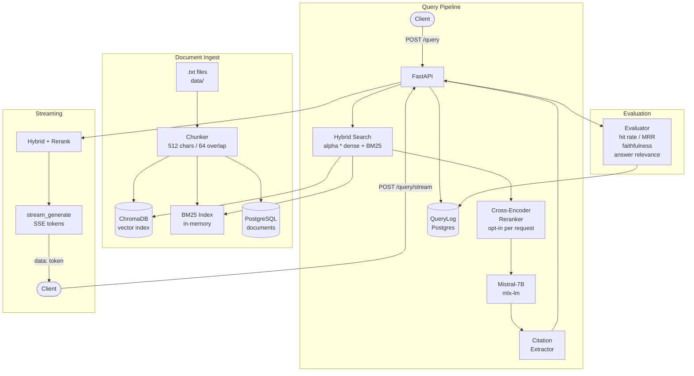

# RAG Pipeline with Evaluation Framework

[](https://github.com/matthew-fitzgerald123/rag-pipeline/actions/workflows/ci.yml)


A retrieval-augmented generation pipeline with hybrid search, cross-encoder reranking, SSE streaming, citation tracking, and a manual evaluation framework. No RAGAS, no torch conflicts, ARM64 native.

## Architecture



## Stack

| Component | Library |
|---|---|
| API | FastAPI + uvicorn (port 8082) |
| Vector store | ChromaDB 0.5.3 (local, persistent) |
| Embeddings | sentence-transformers/all-MiniLM-L6-v2 (CPU) |
| Keyword search | BM25Okapi (rank-bm25) |
| Reranking | cross-encoder/ms-marco-MiniLM-L-6-v2 |
| Generation | mlx-lm + Mistral-7B-Instruct-v0.3-4bit (MLX) |
| Document store + eval logs | PostgreSQL + SQLAlchemy |

## Setup

Requires PostgreSQL running locally. Runs natively on Apple Silicon via mlx-lm, no GPU or torch required.

```bash
createdb rag_pipeline
pip install -r requirements.txt
make ingest        # ingest data/*.txt into ChromaDB + Postgres
```

## Running

```bash
make serve         # API at http://localhost:8082
make demo          # end-to-end demo (requires server)
make test          # run test suite
```

## API Reference

### RAG

| Method | Path | Description |
|---|---|---|
| POST | `/query` | Hybrid retrieve, optional rerank, generate, cite, evaluate |
| POST | `/query/stream` | Same retrieval + SSE streaming generation |
| POST | `/query/eval` | Same as /query with hit rate and MRR against ground truth |

### Monitoring

| Method | Path | Description |
|---|---|---|
| GET | `/eval/summary` | Aggregate metrics across all logged queries |
| GET | `/eval/history` | Recent query log with per-query metrics |
| GET | `/index/stats` | Chunk count, model names, hybrid alpha, reranker |

## Query Options

```json
{
  "query": "What is overfitting?",
  "top_k": 5,
  "rerank": true
}
```

Set `rerank: true` to enable cross-encoder reranking. The cross-encoder scores up to `RERANKER_TOP_K` (default 20) candidates from hybrid search and returns the top `top_k` reranked results.

`/query/eval` takes the same body plus `relevant_doc_ids`, a list of chunk IDs used to compute hit rate and MRR against ground truth:

```json
{
  "query": "What is overfitting?",
  "relevant_doc_ids": ["abc123", "def456"],
  "top_k": 5
}
```

## Citation Tracking

Each `/query` response includes a `citations` field mapping answer sentences to their source chunks:

```json
"citations": [
  {
    "sentence": "Supervised learning trains on labeled data.",
    "citations": [
      {"chunk_id": "abc123", "title": "ml_basics", "overlap": 0.62}
    ]
  }
]
```

## Hybrid Search

Dense vector (cosine similarity) and BM25 keyword scores are normalized then fused:

```
score = HYBRID_ALPHA * dense_score + (1 - HYBRID_ALPHA) * bm25_score
```

Default `HYBRID_ALPHA=0.7`. Each result exposes `dense_score` and `bm25_score` separately.

## Evaluation Metrics

All metrics are implemented manually without RAGAS:

- **Hit rate**: fraction of relevant docs appearing in retrieved results
- **MRR**: mean reciprocal rank, rewards finding the right doc early
- **Faithfulness**: fraction of answer sentences grounded in retrieved context (token overlap proxy)
- **Answer relevance**: token overlap between query terms and answer

## Environment Variables

| Variable | Default | Description |
|---|---|---|
| `DATABASE_URL` | `postgresql://localhost/rag_pipeline` | Postgres connection |
| `CHROMA_PATH` | `./chroma_db` | ChromaDB persistence path |
| `EMBED_MODEL` | `sentence-transformers/all-MiniLM-L6-v2` | Bi-encoder for retrieval |
| `GEN_MODEL` | `mlx-community/Mistral-7B-Instruct-v0.3-4bit` | Generation model |
| `RERANKER_MODEL` | `cross-encoder/ms-marco-MiniLM-L-6-v2` | Cross-encoder for reranking |
| `RERANKER_TOP_K` | `20` | Candidates passed to reranker |
| `HYBRID_ALPHA` | `0.7` | Dense weight in hybrid score fusion |

## Project Structure

```
app/
  main.py           FastAPI app, all routes
  vector_store.py   ChromaDB + BM25 hybrid retrieval
  reranker.py       Cross-encoder reranking
  generator.py      mlx-lm Mistral-7B, batch and SSE streaming
  citations.py      Sentence-level source attribution
  evaluator.py      hit_rate, MRR, faithfulness, answer_relevance
  chunker.py        Sliding-window text chunker
  models.py         SQLAlchemy ORM models
  database.py       Engine and session factory
scripts/
  ingest.py         Bulk ingest .txt files from data/
data/
  ml_basics.txt     Sample ML concepts document
tests/
  test_rag.py       Integration and unit tests
  conftest.py       Session-scoped generator fixture
```
